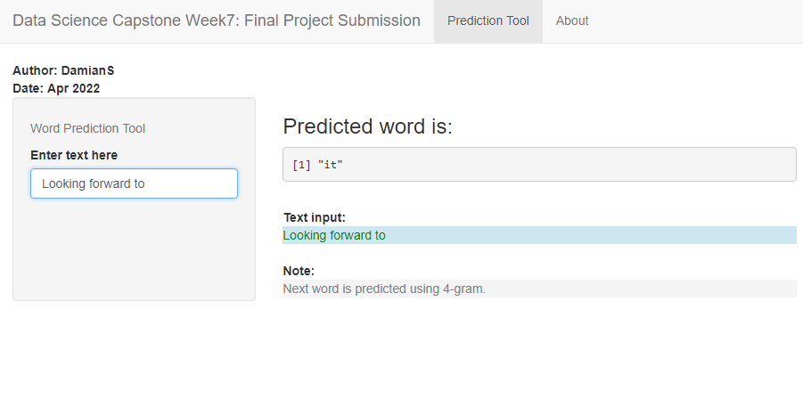

```{r setup, include=FALSE}
knitr::opts_chunk$set(echo = FALSE)
```


## Introduction for Project Submission
This presentation includes description of the word prediction app. 
The goal of project was to create a Shiny app that takes a phrase of words in input text box and outputs a prediction of the next word.

The project application is located at:
- https://damian77504.shinyapps.io/WordApp/

The source code files can be found on GitHub:
- https://github.com/Damian77504/Data-Science-Capstone.git


## Prediction Word Input
Prediction word tool is created by a Shiny app that uses a text prediction algorithm to provide the next word based on entered text.
The application will predict word in a provided sentence using n-gram algorithm. 

- The reference text used to build the prediction word model came from a one, large corpus of blogs, news, and twitter US data. 
- Data are converted to lowercase; strip white space and they are cleaned by removing punctuation and numbers.
- N-gram (Quadgram, Trigram, Bigram) tokens were created from the corpus to build corresponding model.
- A couple of transform methods were explored to reach accuracy using natural language processing technique.

## Prediction Word Model
- Once user text is entered into the tool, the algorithm iterates from longest n-gram (4-gram) to shortest (2-gram). The predicted word is the most frequent matching n-gram. 
- User input text is cleaned like in case of prior prediction word approach
- For prediction of the next word, Quadgram is first used (first three words of Quadgram are the last three words of the user provided sentence).
- If no Quadgram is found, back off to Trigram (first two words of Trigram are the last two words of the sentence).
- If no Trigram is found, back off to Bigram (first word of Bigram is the last word of the sentence)
- If no Bigram is found, back off to the most common word “The” is returned.

## Prediction Word Tool
Screen of user interface for shiny app is presented below:

{width=90% height=90%}


